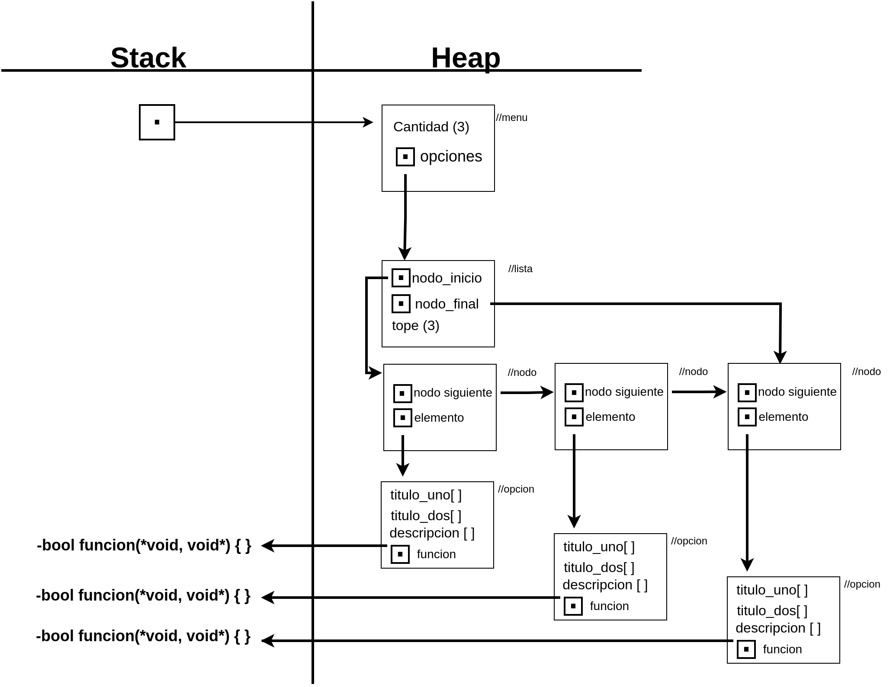

# TP2

## Repositorio de Sebastian Furnier - (110129) - (sfurnier@fi.uba.ar)

- Para compilar:

```bash
make compilar
```

- Para ejecutar:

```bash
make correr
```

- Para ejecutar con valgrind:
```bash
make correr-valgrind
```
---
##  Funcionamiento

Menu: Para este TDA implemente una estructura que almacena una lista (donde se almacenan las opciones del menu) y una variable de tipo size_t donde guardo la cantidad de opciones que posee el menu.

Opciones: Las distintas opciones que se almacenan en el menu, estan implementadas con un tipo de estructura que guarda 3 vectores de char, 2 para los titulos (o nombre de la opcion) y uno para la descripcion de dicha opcion (ayuda). Tambien hay un puntero a una funcion de tipo bool.

Elegi almacenar las opciones en una lista (guardada en el menu) principalmente pensando en la busqueda. Dado que el usuario puede buscar de 2 formas diferentes, ingresando el nombre completo de la opcion o solo una letra por ejemplo "C (cargar)", me fue mas facil pensar en recorrer la lista e ir comparando la eleccion del usuario con los titulos almacenados en cada tda opcion. Si bien tiene una desventaja de complejidad frente a, por ejemplo, una tabla de hash, tome esta decision bajo la suposicion de que un menu suele tener relativamente pocas opciones por lo que el tiempo de recorrido suele ser bajo.

No use una tabla de hash dado que al ingresar una opcion, por ejemplo "c" o  "cargar", la funcion de hash me llevaria a distintas posisicones de la tabla.

La eleccion de opciones se hace en la funcion menu_seleccionar_opcion, esta recibe un string y lo convierte a minusculas en la funcion texto_a_minuscula. Tambien se tiene en consideracion reemplazar el ultimo caracter en caso de que haya sido ingresado leyendo la entrada estandar y este sea un salto de linea.
Con esto garantizo que se seleccionara la opcion elegida ingresando tanto mayusculas como minusculas. Tampoco difiere si la seleccion proviene desde la entrada estandar o a travez de un string alojado en el stack. 

### Ejemplo:

El programa consta de las funciones basicas para la creacion, destruccion y recorrido del menu, mostrar cada titulo de las opciones y mostrar sus descripciones.
Uso tambien la implementacion del tda lista para almacenar las opciones, la misma se crea junto al tda menu. El siguiente es un diagrama que ejemplifica el uso de dichas estructuras de datos:

<div align="center">

</div>

---

## Respuestas a las preguntas teóricas.

El vector dinamico en la estructura hospitales podria ser reemplazado por un ABB, ordenando los pokemones en base a su salud. El unico problema que veo al reemplazar el vector dinamico, es en la funcion hospital_obtener_pokemon, ya que esta funcion devuelve un pokemon en base a su prioridad (nivel de salud). Esto podria solucionarse recorriendo el arbol INORDEN, llevar un conteo de los pokemones visitados y deteniendose cuando coincida con el numero de prioridad buscado.

Considero que no habria problema con las pruebas, al ser un dato abstracto un usuario no sabe de que manera esta implementado el hospital y sus operaciones dado que solo usa las funciones publicas definidas en el .h , estas seguirian teniendo las mismas firmas.

## Comparacion de TDAs respecto a sus complejidades.

### Lista Enlazada:
    
    hospital_a_cada_pokemon: Complejidad O(n), dado que debe recorrerse la totalidad de los pokemones alojados.

    hospital_aceptar_emergencias: Depende la implementacion. Si los nodos se insertan al principio o al final de la lista y en la estructura guardamos un puntero a cada uno de los nodos en estas posiciones, la complejidad es de O(1), dado que se haria una reasignacion de punteros solamente.

    hospital_obtener_pokemon: La complejidad es O(n), considerando que en el peor de los casos debemos recorrer al menos n-1 nodos.
    
### ABB:

    hospital_a_cada_pokemon: Complejidad O(n), dado que debe recorrerse la totalidad de los pokemones alojados.

    hospital_aceptar_emergencias: Si el abb esta implementado de manera recursiva puede aplicarse el teorema maestro. En este caso la insercion de nuevos elementos al arbol es O(log(n)).

    hospital_obtener_pokemon: La complejidad es O(n), dado que en el peor de los casos deberemos recorrer todo el arbol para obtener el pokemon buscado.

